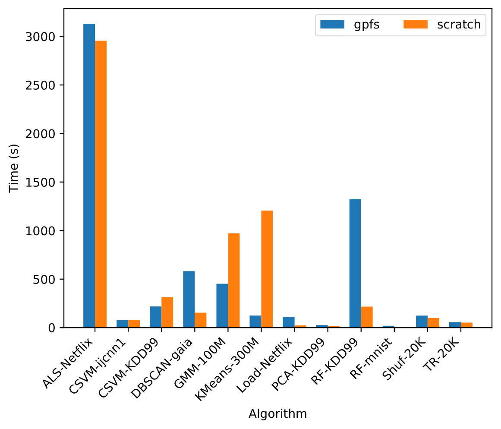

.. image:: ../logos/dislib-logo-full.png
   :width: 600px
   :align: left

.. toctree::
   :maxdepth: 2
   :caption: Contents:
|
|
|
|
|
|
|

The Distributed Computing Library (dislib) provides distributed algorithms ready
to use as a library. So far, dislib is highly focused on machine learning
algorithms, and is greatly inspired by `scikit-learn <https://scikit-learn
.org>`_. However, other types of numerical algorithms might be added in the
future. The main objective of dislib is to facilitate the execution of big
data analytics algorithms in distributed platforms, such as clusters, clouds,
and supercomputers.

Dislib has been implemented on top of `PyCOMPSs <https://www.bsc
.es/research-and-development/software-and-apps/software-list/comp-superscalar
/>`_ programming model, and it is being developed by the `Workflows
and Distributed Computing <https://www.bsc
.es/discover-bsc/organisation/scientific-structure/workflows-and-distributed
-computing>`_ group of the `Barcelona Supercomputing Center <http://www.bsc
.es>`_.

Documentation
-------------

* :doc:`Quickstart <quickstart>`
* :doc:`User guide <user-guide>`
* :doc:`API Reference <api-reference>`
* :doc:`Development <development>`
* :doc:`Glossary <glossary>`

Performance
-----------

The following plot shows fit time of some dislib models on the
`MareNostrum 4 <https://www.bsc.es/marenostrum/marenostrum>`_ supercomputer
(using 8 worker nodes):

Labels on the horizontal axis represent algorithm-dataset, where:

- ALS = AlternatingLeastSquares
- CSVM = CascadeSVM
- GMM = GaussianMixture
- Load = :meth:`load_svmlight_file <dislib.load_svmlight_file>`
- RF = RandomForestClassifier
- Shuf = :meth:`shuffle <dislib.utils.base.shuffle>`
- TR = :meth:`Array.transpose <dislib.data.array.Array.transpose>`

and:

- Netflix = The Netflix Prize `dataset <https://www.kaggle
  .com/netflix-inc/netflix-prize-data>`_.
- KDD99 = The `KDDCUP 1999 <http://kdd.ics.uci.edu/databases
  /kddcup99/kddcup99.html>`_ dataset.
- ijcnn1 = The `ijcnn1 <https://www.csie.ntu.edu
  .tw/~cjlin/libsvmtools/datasets/binary.html#ijcnn1>`_ dataset.
- gaia = The Tycho-Gaia Astrometric Solution dataset [1]_.
- 100M and 300M = 100 and 300 million random samples, with 100 features each.
- mnist = The `mnist <https://www.csie.ntu.edu
  .tw/~cjlin/libsvmtools/datasets/multiclass.html#mnist>`_ dataset.
- 20K = Square matrix of 20 thousand rows and 20 thousand columns, with random values.

Source code
-----------

The source code of dislib is available online at `Github <https://github
.com/bsc-wdc/dislib>`_.

Support
-------

If you have questions or issues about the dislib you can join us in `Slack
<https://bit.ly/bsc-wdc-community>`_.

Alternatively, you can send us an e-mail to `support-compss@bsc.es
<mailto:support-compss@bsc.es>`_.

Citing dislib
-------------

If you use dislib in a scientific publication, we would appreciate citations to the following paper:

\J. Álvarez Cid-Fuentes, S. Solà, P. Álvarez, A. Castro-Ginard, and R. M. Badia, "dislib: Large Scale High Performance Machine Learning in Python," in *Proceedings of the 15th International Conference on eScience*, 2019, pp. 96-105

Bibtex:
.......

.. code:: latex

   @inproceedings{dislib,
               title       = {{dislib: Large Scale High Performance Machine Learning in Python}},
               author      = {Javier Álvarez Cid-Fuentes and Salvi Solà and Pol Álvarez and Alfred Castro-Ginard and Rosa M. Badia},
               booktitle   = {Proceedings of the 15th International Conference on eScience},
               pages       = {96-105},
               year        = {2019},
    } 

Indices and tables
==================

* :ref:`genindex`
* :ref:`modindex`
* :ref:`search`

.. [1] Michalik, Daniel, Lindegren, Lennart, and Hobbs, David, “The
  Tycho-Gaia astrometric solution - How to get 2.5 million parallaxes with less
  than one year of Gaia data,” A&A, vol. 574, p. A115, 2015.
