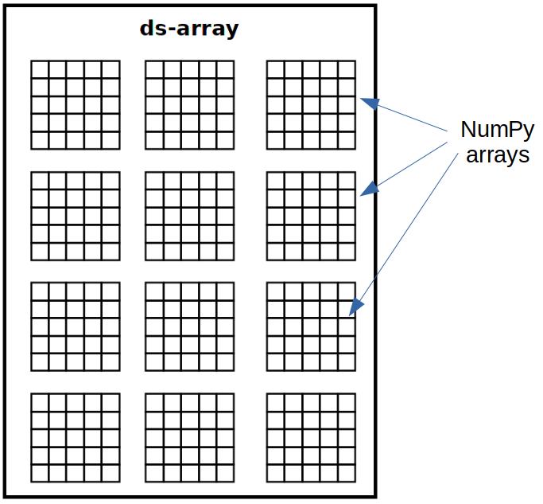
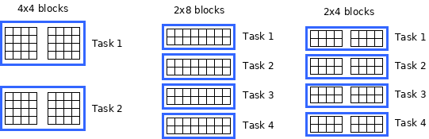

User guide
==========

This guide covers the basics of using dislib, and details on the different
algorithms included in the library.

dislib provides two major programming interfaces: an API to manage data in a
distributed way, and an estimator-based interface to work with different
machine learning models. The distributed data API is built around the
concept of distributed arrays (ds-arrays), and the estimator-based interface
has been inspired by `scikit-learn <https://scikit-learn.org>`_.

The term estimator-based interface means that all the machine learning
models in dislib are provided as `estimator <https://scikit-learn
.org/stable/glossary.html#term-estimators>`_ objects. An estimator is
anything that learns from data given certain parameters. dislib estimators
implement the same API as scikit-learn, which is mainly based on the *fit*
and *predict* operators.

The typical workflow in dislib consists of the following steps:

 1. Reading input data into a ds-array
 2. Creating an estimator object
 3. Fitting the estimator with the input data
 4. Getting information from the model's estimator or applying the model to
    new data

An example of performing :class:`K-means <dislib.cluster.kmeans.base.KMeans>`
clustering with dislib is as follows:

.. code:: python

    import dislib as ds
    from dislib.cluster import KMeans

    # load data into a ds-array
    x = ds.load_txt_file("/path/to/file", block_size=(100, 100))

    # create estimator object
    kmeans = KMeans(n_clusters=10)

    # fit estimator
    kmeans.fit(x)

    # get information from the model
    cluster_centers = kmeans.centers

It is worth noting that, although the code above looks completely sequential,
all dislib algorithms and operations are paralellized using `PyCOMPSs
<https://www.bsc.es/research-and-development/software-and-apps/software-list/comp-superscalar/>`_.

How to run dislib
-----------------

dislib can be installed and used as a regular Python library. However,
dislib makes use of PyCOMPSs directives internally to parallelize all the
computation. This means that applications using dislib need to be executed
with PyCOMPSs. This can be done with the ``runcompss`` or
``enqueue_compss`` commands:

.. code:: bash

    runcompss my_dislib_application.py

For more information on how to start running your dislib applications, refer
to the :doc:`quickstart guide <quickstart>`.

Distributed arrays
------------------

Distributed arrays (ds-arrays) are the main data structure used in dislib.
In essence, a ds-array is a matrix divided in blocks that are stored
remotely. Each block of a ds-array is a `NumPy <https://numpy.org/>`_
array or a SciPy `CSR matrix <https://docs.scipy
.org/doc/scipy/reference/generated/scipy.sparse.csr_matrix.html#scipy.sparse
.csr_matrix>`_, depending on the kind of data used to create the ds-array.
dislib provides an API similar to NumPy to work with ds-arrays in a
completely sequential way. However, ds-arrays are not stored in the local
memory. This means that ds-arrays can store much more data than regular
NumPy arrays.

|

|

All operations on ds-arrays are internally parallelized with PyCOMPSs. The
degree of parallelization is controlled using the array's block size. Block
size defines the number of rows and columns of each block in a ds-array.
Sometimes a ds-array cannot be completely split into uniform blocks of a
given size. In these cases, some blocks of the ds-array will be slightly
smaller than the defined block size. Choosing the right block size is essential
to be able to exploit dislib's full potential.

Choosing the right block size
.............................

The ideal block size depends on the available resources and the
application. The number of tasks generated by a dislib application is
inversely proportional to the block size. This means that small blocks allow
for higher parallelism as the computation is divided in more tasks. However,
handling a large number of blocks also produces overhead that can have a
negative impact on performance. Thus, the optimal block size will allow the
full utilization of the available resources without adding too much overhead.

In addition to this, block size also affects the amount of data that tasks load
into memory. This means that block size should never be bigger than the
amount of available memory per processor.

Most estimators in dislib process ds-arrays in blocks of rows (or samples).
This means that the optimal block size when using these estimators might be
to have as many *horizontal* blocks as available processors. For example,
in a computer with 4 processors, K-means (and other similar estimators)
will usually fit a 100x100 ds-array faster using blocks of size 25x100 than
using blocks of size 50x50, even though the number of blocks is 4 in
both cases.

The diagram below shows how the K-means estimator would process an 8x8
ds-array split in different block sizes.

|

|

Using 4x4 blocks only generates 2 tasks, while using 2x8 blocks generates 4
tasks and provides more parallelism in a system with 4 processors. Using 2x4
blocks provides the same parallelism as 2x8 blocks, but has the overhead of
dealing with five additional blocks. If we were only doing K-means
clustering, 2x8 blocks would probably be the optimal choice in this scenario.

However, some estimators like
:class:`ALS <dislib.recommendation.als.base.ALS>` benefit from having a uniform
number of blocks both vertically and horizontally. In these cases, it might
be better to split the ds-array in NxN blocks, where N is the number of
processors. This splitting strategy can be a good choice if you are not sure
on which block size to use in your application.

Below you will find more details on the parallelization strategy and data
access pattern of each estimator. This can help you to define the
appropriate block size in your application.

Another thing to take into account when choosing block size is task
granularity. As said before, the number of tasks created by dislib is
proportional to the number of blocks (and inversely proportional to block
size). Also, block size is directly proportional to task duration or
granularity (i.e., smaller blocks result in shorter tasks). This is relevant
because, in distributed environments, task scheduling requires communicating
with a remote computer and transferring some data, which has a significant
cost. Thus, long tasks (big blocks) are typically more efficient than short
tasks (small blocks).

For example, if the cost of scheduling a task in a remote computer is 5ms
and the duration of that task is 2ms, running that task in a remotely
is simply not worth the effort as we would be spending more time
communicating than computing. Since task duration is directly related to
block size, it is in general recommended to use big blocks rather than small
ones.

Summary
,,,,,,,

To summarize, there is a trade-off between amount of parallelism, scheduling
overhead and memory usage that highly depends on your platform.
Nevertheless, these are the main ideas when choosing your block size:

1. Ensure that a block of rows fits in the memory of a single processor.
2. Define NxN blocks, where N is the number of processors you want to use.
3. For small ds-arrays, it might be better to use N < number of processors
   and increase granularity at the cost of reducing parallelism.

Creating arrays
...............

dislib provides a set of routines to create ds-arrays from scratch,
or using existing data. The :ref:`API reference <array-creation>` contains the
full list of available routines. For example,
:func:`random_array <dislib.random_array>` can be used to create
a ds-array with random data:

.. code:: python

    import dislib as ds

    x = ds.random_array(shape=(100, 100), block_size=(20, 20))

Another way of creating a ds-array is by reading data from a file. dislib
supports common data formats, such as CSV and `SVMLight <http://svmlight
.joachims.org/>`_, using
:func:`load_txt_file <dislib.load_txt_file>` and
:func:`load_svmlight_file <dislib.load_svmlight_file>`.

Slicing
.......

Similar to NumPy arrays, ds-arrays provide different types of slicing. The
result of an slicing operation is a new ds-array with a subset of elements
of the original ds-array.

Currently, these are the supported slicing methods:

``x[i]``
  returns the ith row of x.

``x[i,j]``
  returns the element at the (i,j) position.

``x[i:j]``
  returns a set of rows (from i to j), where i and j are optional.

``x[:, i:j]``
  returns a set of columns (from i to j), where i and j are optional.

``x[[i,j,k]]``
  returns a set of non-consecutive rows.

``x[:, [i,j,k]]``
  returns a set of non-consecutive columns.

``x[i:j, k:m]``
  returns a set of elements, where i, j, m, and n are optional.

Other operations
................

Classification
--------------

Cascade SVM
...........

Random forest classifier
........................
:class:`RandomForestClassifier <dislib.classification.rf.forest.RandomForestClassifier>` is a classifier that uses an
ensemble of decision trees and aggregates their predictions. The process of building each decision tree includes some
randomization in order to make them different. The accuracy of the joint prediction can be greater than that of
individual decision trees. One advantage of Random Forests is that you cannot overfit by increasing the number of
trees. Several variations of random forests have been proposed and implemented. A fundamental paper that has been cited
extensively is Breiman 2001, which describes the following method for classification problems:

"For building each tree, the original sample set is replaced by a set of the same size, obtained by drawing with
replacement (this method is called bootstrap aggregating or bagging). At each tree node, a certain number of random
features is selected (random feature selection). The sample set is splitted in two according to the values of these
features, and a metric called 'Gini impurity' is computed for every split. The Gini impurity measures how heterogeneous
is one sample set with respect to the target variable. The split with the lowest 'Gini impurity' is selected, and the
subsamples are propagated to the children nodes. The trees grown are not pruned."

Ensemble estimators can be implemented in an embarrassingly parallel pattern. You can do this with scikit-learn's
RandomForestClassifier using a joblib.parallel_backend and setting the n_jobs parameter. However, you need to be able
to load your data into memory for each processor or to use memory mapped arrays, which can be tricky specially with a
distributed backend.

In our implementation, the samples as a whole are written into a binary file and accessed using memory maps (the COMPSs
runtime manages the transfers to other nodes when needed). We used this approach because the performance penalty of
using distributed data was too large. Storing the samples file and saving the decision trees introduces a big load
to the disk storage of all nodes. If your execution fails because you reach your disk storage limits, you can try
reducing the number of trees or reducing their size by setting the max_depth parameter. If this is not enough, you may
consider reducing the samples.

In order to get further parallelism, each decision tree is not necessarily built in a single task: there are tasks for
building just a subtree, just a node or even just part of a node. You can use the distr_depth parameter to control the
number of tasks used for each tree. However, be aware that the number of tasks grows exponentially when you increase
distr_depth, and that the task loads become very unbalanced. The fitted decision trees are not synchronized, so the
prediction is equally distributed.

The results of the RandomForestClassifier can vary in every execution, due to its random nature. To get reproducible
results, a RandomState (pseudorandom number generator) or an int can be provided to the random_state parameter of the
constructor. This works by passing a seed (generated by the master's RandomState) to each task that uses randomness,
and creating a new RandomState inside the task.

Clustering
----------

K-means
.......

DBSCAN
......
:class:`DBSCAN <dislib.cluster.gm.base.DBSCAN>` is a clustering algorithm that uses the neighbouring relations of the
samples for determining the clusters. It requires two parameters: the neighbouring distance ε (eps), and the minimum
number of samples in a neighbourhood min_samples, which define the clusters according to some rules.

An advantage of DBSCAN over other clustering algorithms is that it can find regions of arbitrary shapes, including
non-convex regions. Another advantage is that you don't have to specify the number of clusters: it will depend on the
data. A disadvantage is that you need to find the values for eps and min_samples that work for your problem, and
sometimes these global parameters may not cluster all of your data satisfactorily.

In our implementation, the samples are partitioned according to the regions of a multidimensional grid of the feature
space. Then, for each region, the neighbours of each sample are computed, taking into account that there may be
neighbours in the same region but also in other regions. This can be divided into multiple tasks for regions that
contain many samples. A partial DBSCAN is performed for each region, and finally the clusters found in different
regions are merged to create the final clusters. Some synchronizations are necessary, and the dependency graph of the
generated tasks is complex, but enough parallelism is achieved to speed up some executions.

The parameters n_regions, dimensions and max_samples define the workflow of the distributed execution, and it is
very important to understand them for working with large datasets. The first two define your multidimensional grid. The
regions of the grid shouldn't be thinner than eps, because that would mean having to compare to many regions to find
the samples neighbours, creating many data dependencies that slow down the execution. For the same reason, you don't
want to partition along more than a few dimensions either. On the other hand, you want a big number of regions to
achieve greater parallelism. Additionally, your data shouldn't be partitioned very unevenly, as it could cause strong
load imbalances among the tasks.

For some problems, it's not possible to carry out all of the previous recommendations at the same time, specially if
your eps is not small or the number of features is big, and it may mean that this implementation is not the most
appropriate. But if epsilon is relatively small and even partitions can be made, this implementation can have a good
scalability for big numbers of samples.

Gaussian mixture
................
:class:`GaussianMixture <dislib.cluster.gm.base.GaussianMixture>` fits a gaussian mixture model that represents the
distribution of the sample as the sum of several gaussian components. The aim is to maximize the likelihood that the
obtained model describes the observed data. A fitted gaussian mixture model can be used to generate new samples that
follow the same distribution. It can also be used for clustering, by assigning to each individual the component with
highest probability density at that point.

Our implementation is based on the sequential implementation in scikit-learn,
[https://scikit-learn.org/stable/modules/generated/sklearn.mixture.GaussianMixture.html]
which uses an iterative expectation–maximization (EM) algorithm.
[https://www.ics.uci.edu/~smyth/courses/cs274/notes/EMnotes.pdf]
In the expectation step, given the gaussian components, membership weights to each component are computed for each
element in the sample. In the maximization step, these memberships are used to compute the parameters of the gaussian
components that maximize the likelihood. These iterations are repeated until a termination criteria is met: either the
change of a certain indicator is below a convergence threshold, or the number of iterations reaches a given limit.

For distributing the execution, the samples are partitioned by row blocks. The expectation step of each iteration is
computed in a map-reduce pattern, where the reduction is used as a termination criteria for the next iteration but it
does not block the maximization step. The maximization step has two parts, the first one for updating the weights and
the centers of the components, and the second one for updating their covariances. These parts are computed in
successive map-reduce patterns, and this completes the iteration.

With the parameter covariance_type you can define the shape of the gaussian components (see image). Internally,
this is represented by a covariances array whose shape depends on the covariance_type:
            (n_components,)                        if 'spherical',
            (n_features, n_features)               if 'tied',
            (n_components, n_features)             if 'diag',
            (n_components, n_features, n_features) if 'full'.
If the number of features of your data is big, the 'full' and 'tied' option can be computationally more expensive.
Moreover, the covariances array is loaded into memory and processed as a single piece, so you could run into memory
problems. Our implementation is designed to scale on the number of samples, but not on the number of features.

The EM algorithm can converge to a local optimum, and the results are sensible to the initialization. By default, this
estimator uses KMeans to initialize the centers, which accelerates the execution. You can also provide your own
parameters or use random initialization. It is a good idea to run the algorithm multiple times with different starting
conditions, because it can converge to different local optima.

Regression
----------

Linear regression
.................
:class:`LinearRegression <dislib.regression.linear.base.LinearRegression>` performs multivariate linear regression with
ordinary least squares. The model is: y = alpha + beta*x + err, where alpha is the intercept and beta is a vector of
coefficients. The goal is to choose alpha and beta that minimize the sum of the squared errors. These optimal
parameters can be computed using linear algebra. First, if we want to have an intercept term, x is extended with an
additional ones column. Then, the coefficients are given by inv(x.T@x)@x.T@y.

In our implementation, we compute x.T@x and x.T@y separately with map-reduce patterns, partitioning the samples only
by row blocks. Each rows block of x is extended with the ones columns, if necessary, in the same tasks that do the
products. As we are using row blocks as a whole, without vertical partitioning, the resulting x.T@x and x.T@y
consist of a single block each. Finally, the coefficients are computed in a single task by solving a linear system with
np.linalg.solve, avoiding the unneeded computation of the inverse matrix.

This implementation is designed for a good scalability for big numbers of samples. However, it cannot give any
additional scalability with respect to the number of features, because we hold in memory the x.T@x matrix, of shape
(n_features, n_features) and process it as a single block. (To have scalability for big numbers of features, we would
need to integrate this with a distributed implementation of a method for solving a system of linear equations.)

Decomposition
-------------

Principal component analysis
............................
:class:`PCA <dislib.decomposition.pca.base.PCA>` performs principal component analysis using the covariance method.
First, in the covariance method, features are centered (the mean is substracted for each feature) but not standarized
(not divided by the standard deviation, which would be the correlation method). Then, the covariance matrix is
estimated as x.T@x / (n_samples - 1). Finally, the eigendecomposition of this matrix is computed, yielding the
principal components (eigenvectors) and the explained variance (eigenvalues).

In our implementation, centering the features and estimating the covariance matrix are computed in two succesive
map-reduce phases, partitioning the samples only by row blocks. Hence, we obtain an unpartitioned covariance matrix, of
shape (n_features, n_features). This matrix is processed by a single task which computes the eigendecomposition
using the numpy.linalg.eigh method. We can use this method, which is faster than the generic numpy.linalg.eig, because
we know that the estimated covariance matrix is symmetric.

Our distributed implementation offers a good scalability for big numbers of samples. However, it cannot give any
additional scalability with respect to the number of features, because we hold the covariance matrix in memory and
process it as a single block. (To have scalability for big numbers of features, we would need to integrate this with a
distributed implementation of the eigendecomposition or to use a covariance-free algorithm.) If you have n_features >>
n_samples and your data fits in memory, it may make sense to try centering the data and then calling np.linalg.svd for
equivalent results.

Lastly, bear in mind that even if you are specifying a small value for the parameter n_components (<< n_features), we
are still computing the full eigendecomposition, so the fit() method will not run faster.

Pre-processing
--------------

Standard scaler
...............

Neighbors
---------

K-nearest neighbors
...................

Model selection
---------------

Grid search
...........

Randomized search
.................
